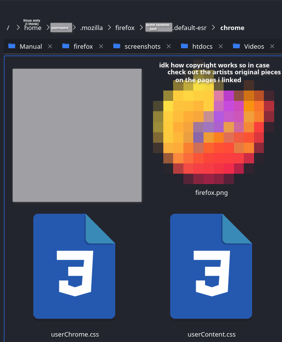
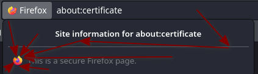
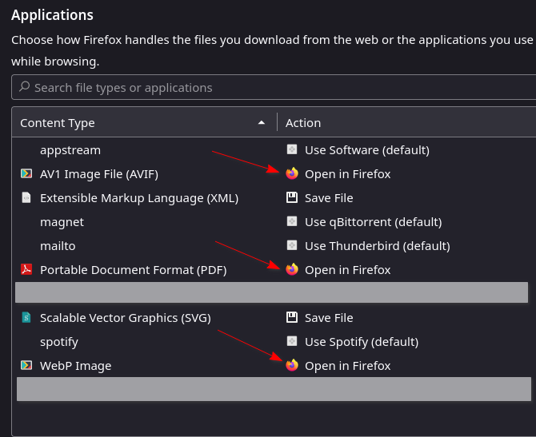

# btw i have no idea if this poses any security risks so use on your own responsibility (yes i'm using that too, because i love it)
cheers 
also, i urge anyone wanting to do this do read the comments in the .css files 
(css comment example: /\*  comment, can be multi line \*/) 
btw you need to restart firefox after changing anything in the .css files if that helps 

# how to:
first this: 
things after live-testing aren't needed there 
https://www.reddit.com/r/FirefoxCSS/comments/73dvty/tutorial_how_to_create_and_livedebug_userchromecss/  

# then get some image files 
in this example i use those by [lux](https://twitter.com/LuxxArt) (love ya art lux) 
https://twitter.com/LuxxArt/status/1727019006186664230 
name it firefox.png 
put it into the ["chrome"](https://support.mozilla.org/en-US/questions/937284) folder  
folder in question: 
 and that's probably all the setup for now   
working on other replaceable places 

# what's unfinished (i have no css skills):
this one on almost every firefox built-in page: 
 
(sidenote: to change the lockbar icon to custom thingy you need to uncomment one thing in the userChrome.css 
why?, because i'm not sure if there are more lock icons. for now it is set to change for when tooltip is either: 
"Verified by" or "" \[on firefox about:\])   

about:preferences: 
i've tried a lot 
   

and probably other things i forgot about 

# some other text
hey you no longer need to resize that one image :+1: (happy = this does support emotes) 
i may even learn web formating doing this 
finally a good use for my free time

# made by one dude who last touched CSS like two years ago for some ass competition that he failed miserably
man i hate my country 
you can message me on my dc if you find something new/undone (there is): 42majorspellingmistakes   

i don't really care about licensing and stuff so have fun everyone 
see ya <3