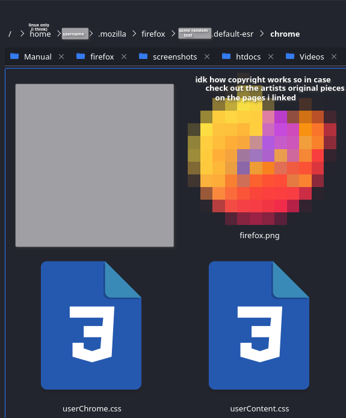
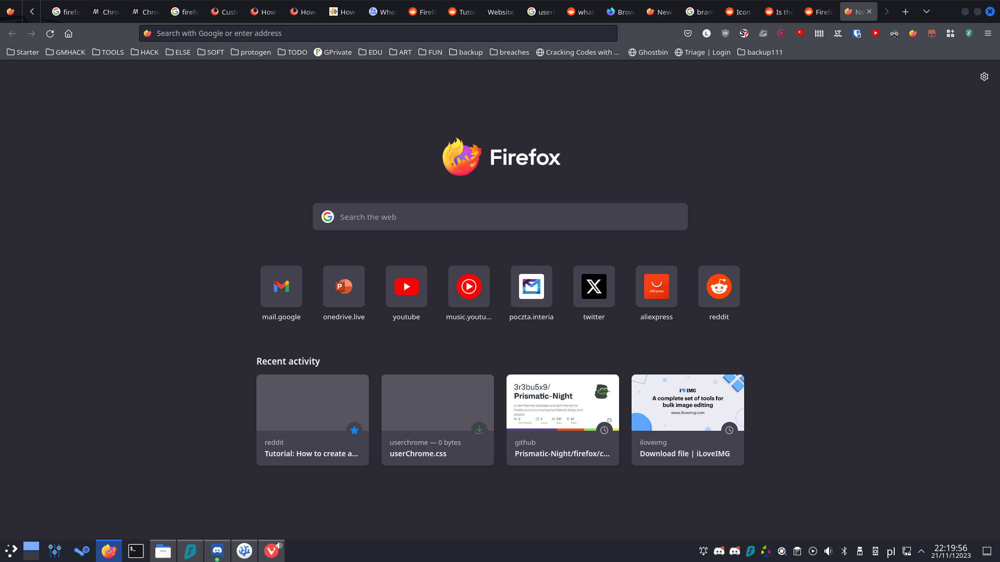
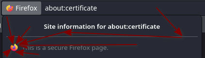
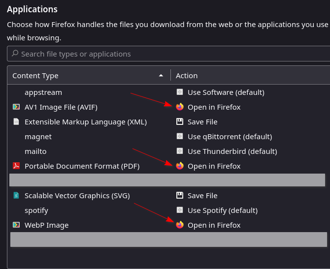

damn that how-to WAS trash. remake.


# I have no information if this poses any security vournerabilities<br><br>
# USE AT YOUR OWN RISK<br><br>
cheers<br>
also, i urge anyone wanting to do this do read the comments in the .css files<br>
(css comment example: /\*  comment, can be span in multiple lines of code \*/)<br>
btw you need to restart firefox after changing anything in the .css files if that helps<br>

# how to:
open ```about:config```<br>
paste this in ```toolkit.legacyUserProfileCustomizations.stylesheets``` and set it to true<br>
open ```about:support``` and open ```profile directory```<br>
inside the directory create a folder named ```chrome``` (the '[chrome](https://firefox-source-docs.mozilla.org/build/buildsystem/chrome-registration.html)' isn't owned by google and is actually an browser element)<br>
go inside the ```chrome``` folder<br>
in it copy the ```userChrome.css``` and ```userContent.css``` files, with their respective contents (you can also name the files however you like and use the ```@import``` rule from CSS<br>
obtain an image and name it firefox.png<br>
restart firefox<br>
done<br>

# Example
in this example I use those by [lux](https://twitter.com/LuxxArt)<br>
https://twitter.com/LuxxArt/status/1727019006186664230<br>
folder example:<br><br>
better examples coming in the future
<br>

# TODO
this one on almost every firefox built-in page:<br>
<br>
(sidenote: to change the padlock icon to custom thingy you need to uncomment two lines of code in the userChrome.css<br>
why?, because i'm not sure if there are more padlock icons. for now the commented configuration is set to change for when tooltip is either:<br>
"Verified by" or "" \[on firefox about:\*\])<br><br><br>

about:preferences:<br>
i've tried a lot<br>
<br><br><br>

and probably other things i forgot about<br>

# some other text
you can message me on my dc if you find something new/undone (there is): 42majorspellingmistakes<br>
I'm better known as Lumi Tassu<br><br><br>
good luck and have fun with your firefox o7<br>
